# Alteryx Cloud API Code Examples

This repository contains examples of calling Alteryx Cloud APIs in various programming languages.

Below are the steps to run and use the examples.

## 1. Download this repository

Either click the "Code > Download Zip" button.

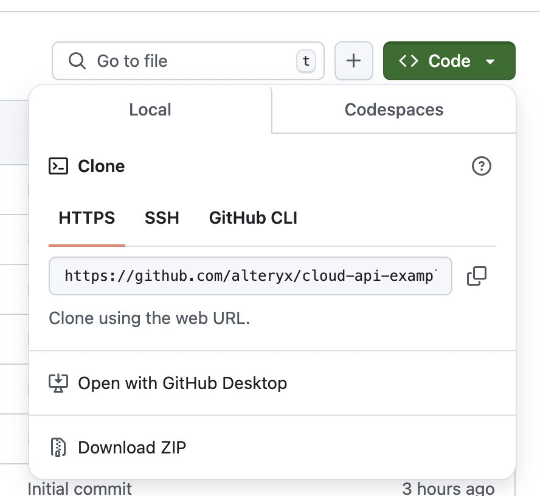

Or, use `git clone`.

Open the files in the downloaded folder.

## 2. Set up credentials

### `aac_url.txt`

In the downloaded `cloud-api-example-code` folder, open `aac_url.txt`.

Ensure this file has the appropriate Alteryx Cloud URL. This is the same url you see in your web browser when using Alteryx Cloud, plus "api".

This is one of

- `https://api.us1.alteryxcloud.com`
- `https://api.eu1.alteryxcloud.com`
- `https://api.au1.alteryxcloud.com`

Make sure to save the file.

### `client_id.txt`

In the downloaded `cloud-api-example-code` folder, open `client_id.txt`.

Populate this file with your application ID from Alteryx Analytics Cloud.

1. Visit <https://us1.alteryxcloud.com/cloud-portal/library/alteryx-io> (or <https://eu1.alteryxcloud.com/cloud-portal/library/alteryx-io> or <https://au1.alteryxcloud.com/cloud-portal/library/alteryx-io> for other regions). Ensure that you're logged in to the workspace in which you wish to use APIs. 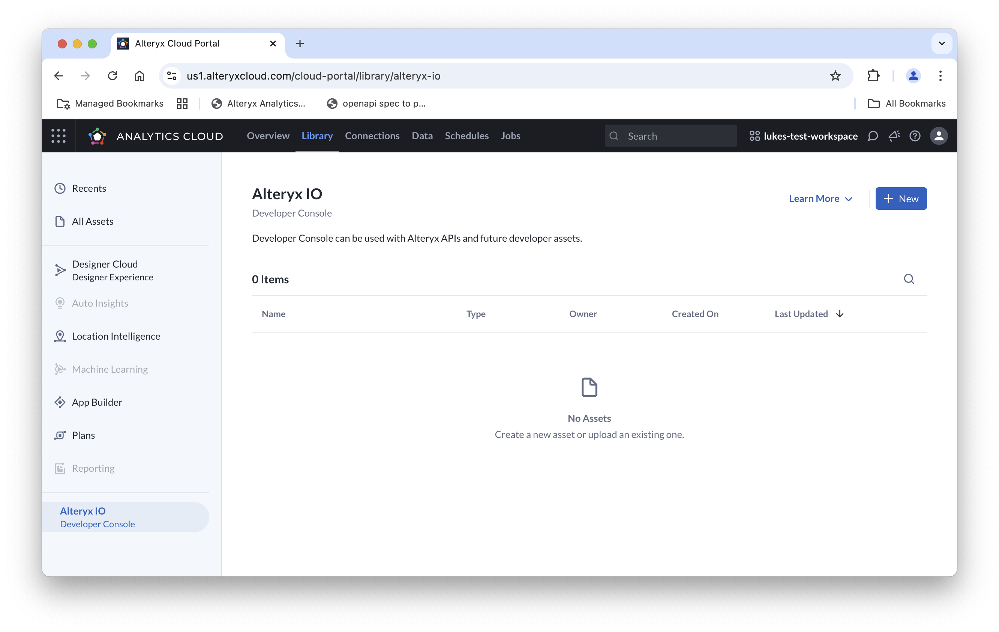

1. Click the "+ New" button to create a new API Project. Enter a name for your new project, then click "Save". 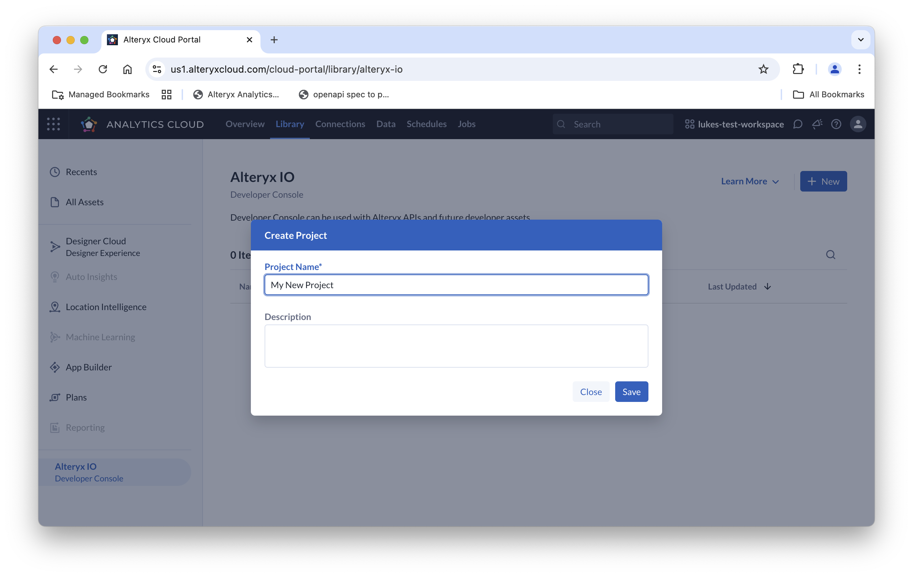

1. You should see your new project in the list of projects. 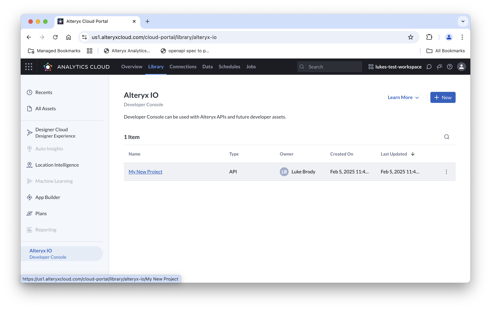

1. Click on the project and copy the Client ID to your clipboard. 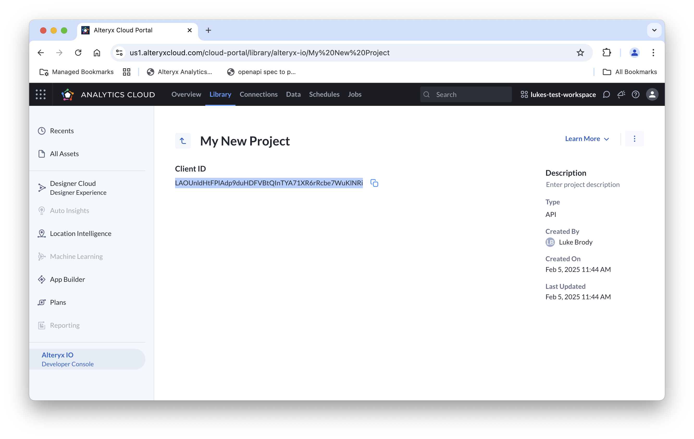

1. Open the `client_id.txt` file in this repository, and paste in the copied Client ID. Be sure to save the file. 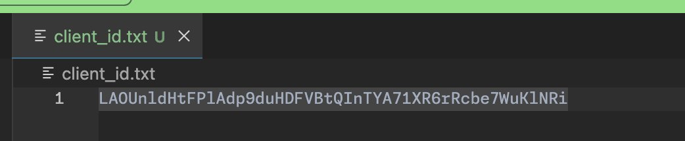

### `creds.json`

In the downloaded `cloud-api-example-code` folder, open `creds.json`.

This file will contain authentication credentials.

1. Navigate to <https://us1.alteryxcloud.com/cloud-portal/preferences/oauth2-api-tokens> (accessible via Your Avatar > User Preferences > OAuth 2.0 API Tokens) (navigate to eu1 or au1 as appropriate). 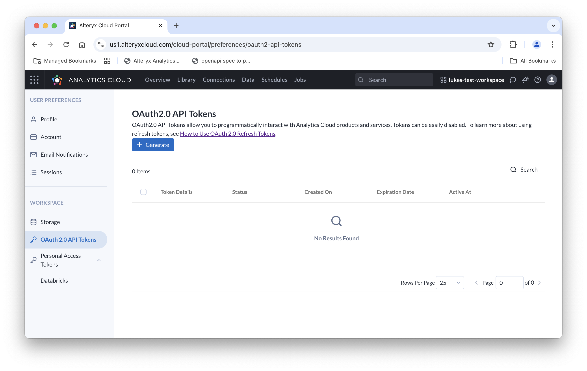

1. Click "+ Generate". Enter a name for your token, and a duration in days that the token will work. 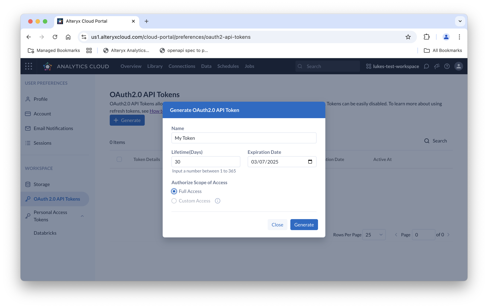

1. Click "Generate". The dialog box will show two tokens. The "access token" and the "refresh token". 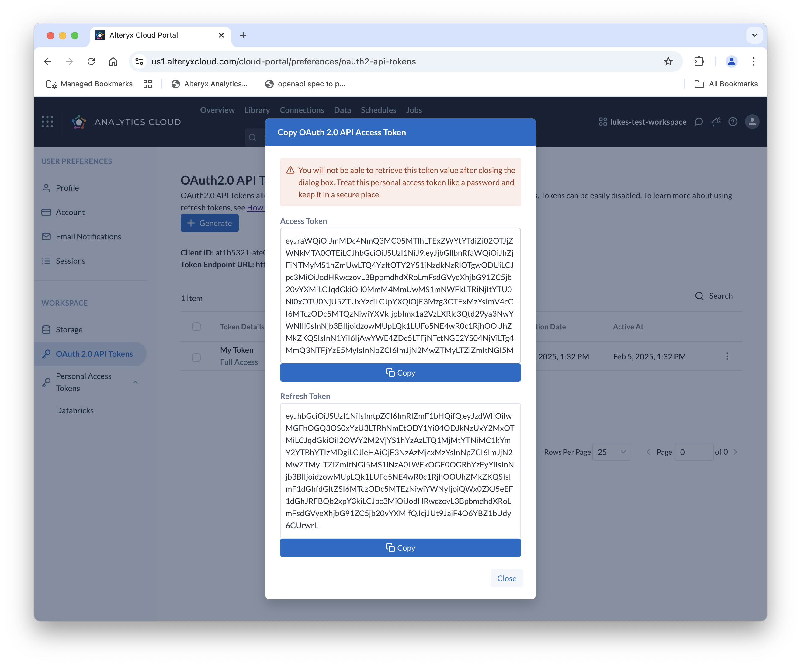

1. Copy and paste the tokens into `creds.json`, replacing `Your access token here` and `Your refresh token here` (but leaving the quotation marks).
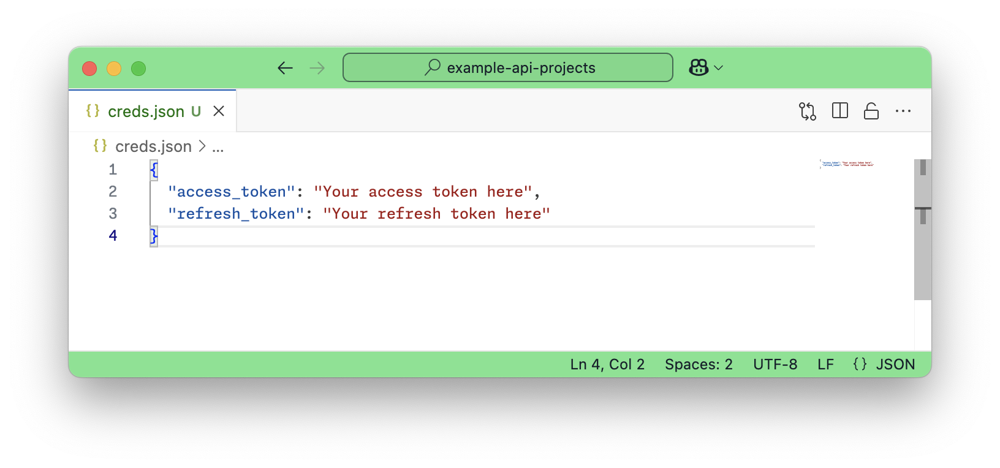
*creds.json before paste*
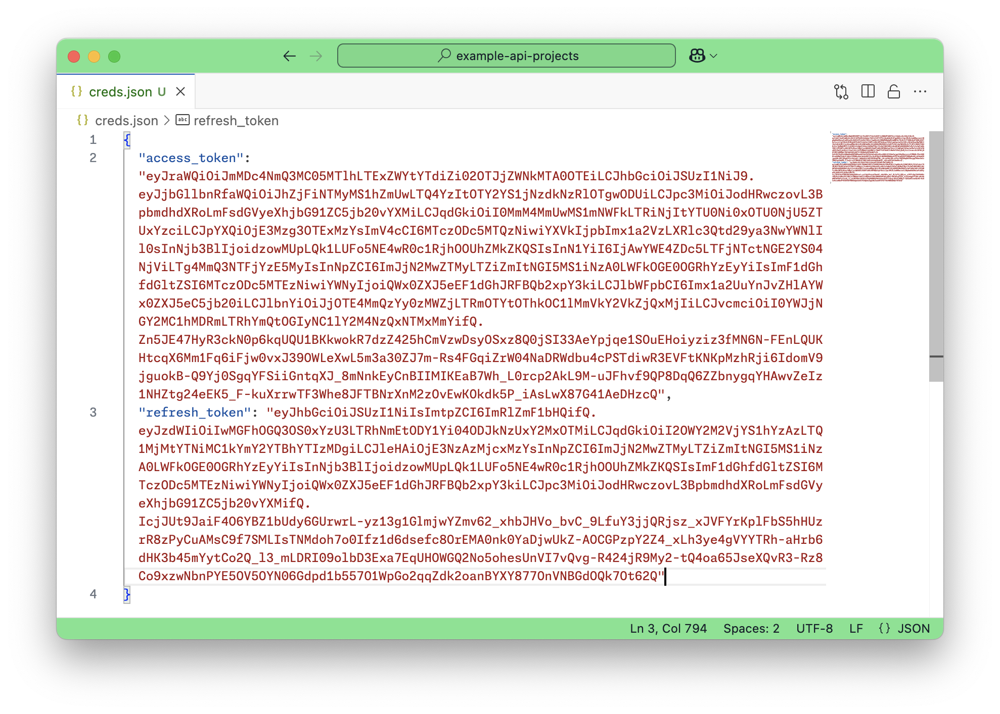
*creds.json after paste*\
\
**Note: These credentials are sensitive, and anyone who obtains them can access your Alteryx Cloud account. It's recommended to keep them in a credentials vault rather than in plaintext.**

## 3. Run a program

Now, you are ready to run an example program. Each program will

1. Ensure the tokens are up to date. The "access token" has a limited duration where it can be used for API requests. When the access token expires it will no longer work for API requests, and the program must acquire a new access token from the server. This is what the refresh token is for. The program exchanges the refresh token for a new access token and refresh token. Once a refresh token has been used, it is no longer valid. The program writes the new access and refresh tokens back to the creds.json file. Since all programs share the file, you can alternate between running multiple programs.

1. Call the `/iam/v1/workspaces/current` API, and print the result. This gets information about your current workspace. Try modifying this call in each program to call a different API. You can see available APIs here: <https://core-apigee-upper-produs1.apigee.io/>

### Running the Python Example

Open your Terminal or command line.

*Ensure you have at least Python 3.10 or later installed on your computer. [Download Python here.](https://www.python.org/downloads/)*

Make sure you are `cd`ed into the `cloud-api-example-code` folder.

Run

```bash
python3 get_workspace.py
```

(on some machines, you may need to use `python get_workspace.py` instead.)

The expected output looks like this:

```json
{'id': 31429, 'name': 'lukes-test-workspace', 'state': 'active', 'lastStateChange': None, 'custom_url': 'lukes-test-workspace.us1.alteryxcloud.com', 'max_user_number': 5000, 'gid': '01JKBMKPZ94N0GG5F8N9HY2FJA', 'createdAt': '2025-02-05T18:05:29.000Z', 'updatedAt': '2025-02-05T18:05:29.000Z', 'workspacetiers': {'data': [{'isSingleUser': False, 'id': 31428, 'name': 'enterprise_cloud22', 'startsAt': '2025-02-05T18:05:29.000Z', 'trialState': 'None', 'workspace': {'id': 31429}}]}, 'workspace_member_count': 2, 'workspace_tier': 'enterprise_cloud22', 'emrCluster': None}
```

### Running the JavaScript example

Open your Terminal or command line.

*Ensure you have at least Node.js 16 or later installed on your computer. [Download Node.js here.](https://nodejs.org/en/download)*

Make sure you are `cd`ed into the `cloud-api-example-code` folder.

Run

```bash
node get_workspace.mjs
```

The expected output looks like:

```json
{
  id: 31429,
  name: 'lukes-test-workspace',
  state: 'active',
  lastStateChange: null,
  custom_url: 'lukes-test-workspace.us1.alteryxcloud.com',
  max_user_number: 5000,
  gid: '01JKBMKPZ94N0GG5F8N9HY2FJA',
  createdAt: '2025-02-05T18:05:29.000Z',
  updatedAt: '2025-02-05T18:05:29.000Z',
  workspacetiers: { data: [ [Object] ] },
  workspace_member_count: 2,
  workspace_tier: 'enterprise_cloud22',
  emrCluster: null
}
```

### Running the bash example

*Ensure you have `jq` installed on your computer. The most common way to do this on Mac is to [install Homebrew](https://brew.sh/) and then run `brew install jq`*

Make sure you are `cd`ed into this folder.

Run

```bash
./get_workspace.sh
```

The expected output looks like:

```json
{ "id": 31429, "name": "lukes-test-workspace", "state": "active", "lastStateChange": null, "custom_url": "lukes-test-workspace.us1.alteryxcloud.com", "max_user_number": 5000, "gid": "01JKBMKPZ94N0GG5F8N9HY2FJA", "createdAt": "2025-02-05T18:05:29.000Z", "updatedAt": "2025-02-05T18:05:29.000Z", "workspacetiers": { "data": [ { "isSingleUser": false, "id": 31428, "name": "enterprise_cloud22", "startsAt": "2025-02-05T18:05:29.000Z", "trialState": "None", "workspace": { "id": 31429 } } ] }, "workspace_member_count": 2, "workspace_tier": "enterprise_cloud22", "emrCluster": null }
```

## Troubleshooting

### `Invalid ApiKey`

```json
{
  fault: {
    faultstring: 'Invalid ApiKey',
    detail: { errorcode: 'oauth.v2.InvalidApiKey' }
  }
}
```

Ensure that your client ID in `client_id.txt` is present and correct. See instructions above.

### `rllib.error.URLError: <urlopen error [SSL: CERTIFICATE_VERIFY_FAILED] certificate verify failed: unable to get local issuer certificate (_ssl.c:997)>`

If you've installed Python by downloading it into a folder, find that installation folder (e.g. `/Applications/Python 3.10`). Inside the folder there should be a `Install Certificates.command` file. Run this file by double-clicking it.

## Next Steps

- Use this code to call different APIs.
- Integrate similar code into your application.
